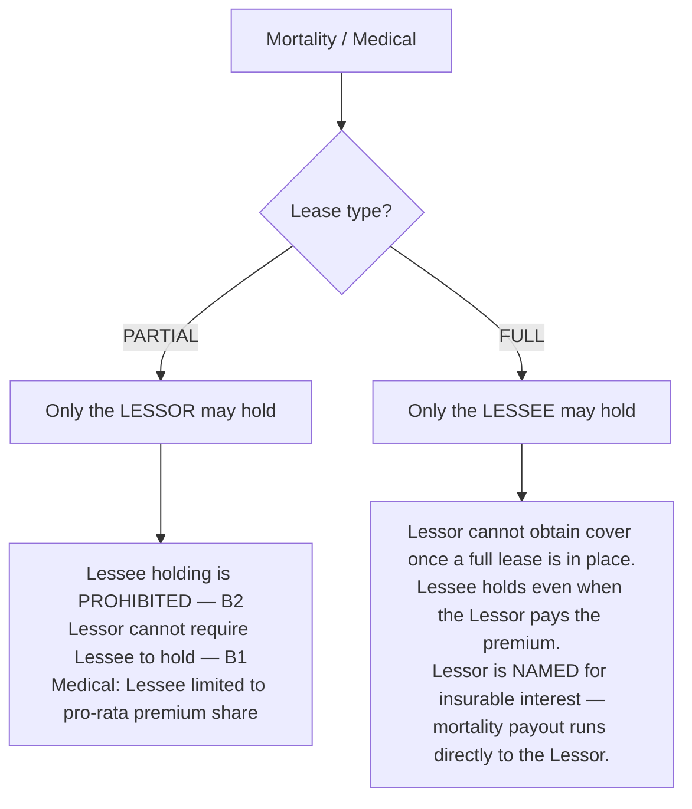
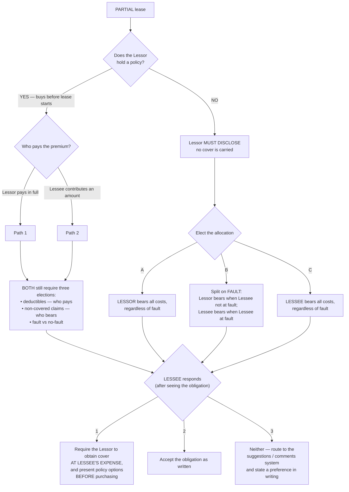
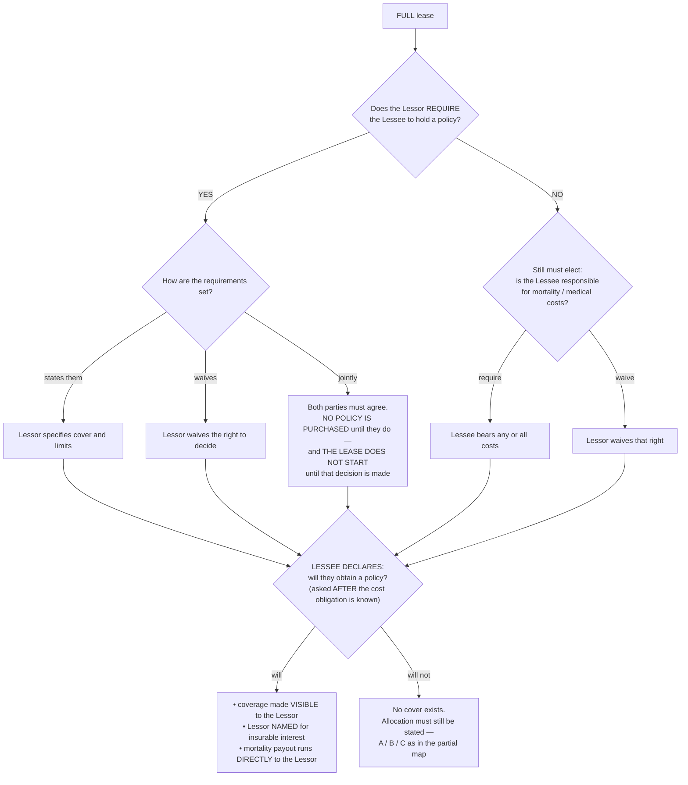
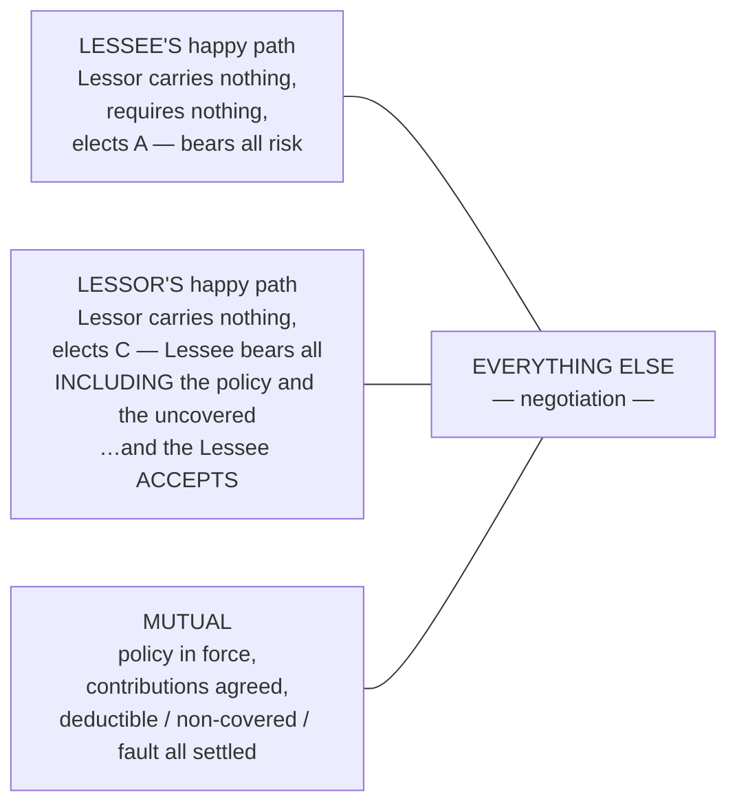

# Insurance decision map — mortality and medical

**The flow charts behind the gates.** Built from the owner's five-question model
(2026-08-07), the corrected eligibility matrix in `docs/INSURANCE_CONTROL_SET.md` §2a, and
the elections recorded in `docs/tasks/TASK-LEASEGATE-Q1-ANSWER-insurance-disclosure.md`.

**General Liability is deliberately excluded.** The owner has stated GL neither affects nor
is affected by mortality and medical, and whether it takes this same treatment is still an
open question. Do not assume these maps apply to it.

Mermaid diagrams below render in VS Code's markdown preview.

---

## The five questions, and why the order matters

| # | Question | Decided by |
|---|---|---|
| 1 | **Is a policy available?** | coverage type + insurable interest |
| 2 | **Who is it available to?** | **lease type** — this is the inversion point |
| 3 | **Is holding it required?** | Lessor's election, bounded by Q2 |
| 4 | **What will actually be held?** | the holder's declaration |
| 5 | **What is each party contributing?** | negotiated within the bounds of 1–4 |

**Q1 and Q2 are facts, not preferences.** They come from how equine policies are written and
cannot be negotiated by the parties. **Q3–Q5 are elections.** Most confusion in this section
comes from treating Q2 as negotiable — it is not.

**Medical follows mortality throughout.** If mortality is not in force, medical does not
exist. Resolve the mortality column first, then medical, with cost responsibility elected
separately for each.

---

## Q1 → Q2: who may hold, by lease type

**This is the single most important fact in the section**, and it is the one the original
matrix got wrong: **lease type governs who may hold; insurable interest governs where the
payout goes.**

---

## PARTIAL lease — Lessor-led, Lessee counters

The Lessor initiates every election. The Lessee's response is structured, not free-form.

### Why response 1 exists

On a partial lease the Lessee **cannot hold mortality themselves**. So when the Lessor
carries nothing and elects B or C, the Lessee is being handed an exposure they are
structurally barred from insuring. Their only route is to have the **Lessor** buy a policy
at the **Lessee's** expense — which is why the "show me the options first" half is not
optional. Paying for a policy chosen without sight of the options is the abuse this
prevents.

---

## FULL lease — the Lessee holds, the Lessor is named

**"Require or do not require" is not a sufficient election in either direction.** Requiring
obliges the Lessor to state requirements, waive that right, or agree jointly. Not requiring
still obliges an election about who bears cost. There is no silent path.

---

## The happy paths — and how narrow they are

The owner's framing: *"outside of those three scenarios the water gets muddy fast."* The
Lessor's happy path is **conditional on the Lessee's agreement**, which makes it not really
a path at all until the Lessee answers. That is the asymmetry the whole design has to
absorb.

---

## What still has no answer

These are not modelled above because they are undecided. **Do not build past them.**

1. **Who determines fault, and when?** Allocation **B** rests entirely on "the Lessee is at
   fault", and the document has no fault-determination mechanism. Without one, B is
   unenforceable. **A question for counsel, not a build question.**
2. **Do Paths 1 and 2's three elections** — deductibles, non-covered claims, fault vs
   no-fault — reuse A/B/C, or are they their own fields?
3. **Does General Liability take this treatment at all?**
4. **Do mortality policies carry deductibles?** Owner researching. `MORT_DEDR_SIMPLE` and
   `MORT_DEDR_SPLITC` exist in the template today and would be stripped if not.
5. **"The lease does not start until both agree"** — is that a signing block
   (`contract_lock_blockers`, which exists) or a commencement block (which does not)?
   Possibly both.

## Two facts that bound everything here

- **`TXN.LEASE_TYPE` reaches no insurance clause or field today.** Every map above branches
  on it. That wiring must exist before any of this can be gated — it is not in LEASEGATE's
  scope.
- **Zero documents use `HORSE_LEASE_STANDARD`, and new leases still default to
  `HORSE_LEASE_V2`.** Everything built here is inert until that default flips.
